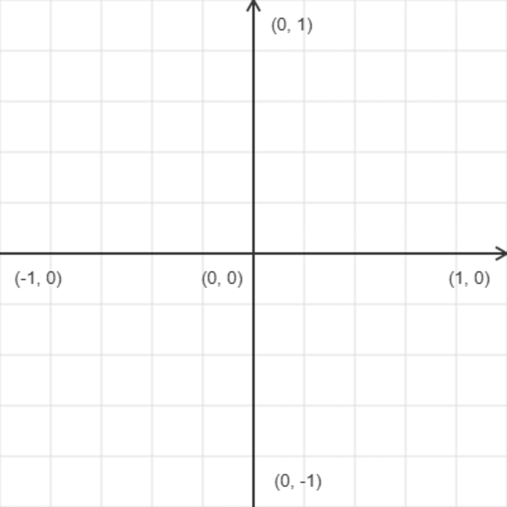
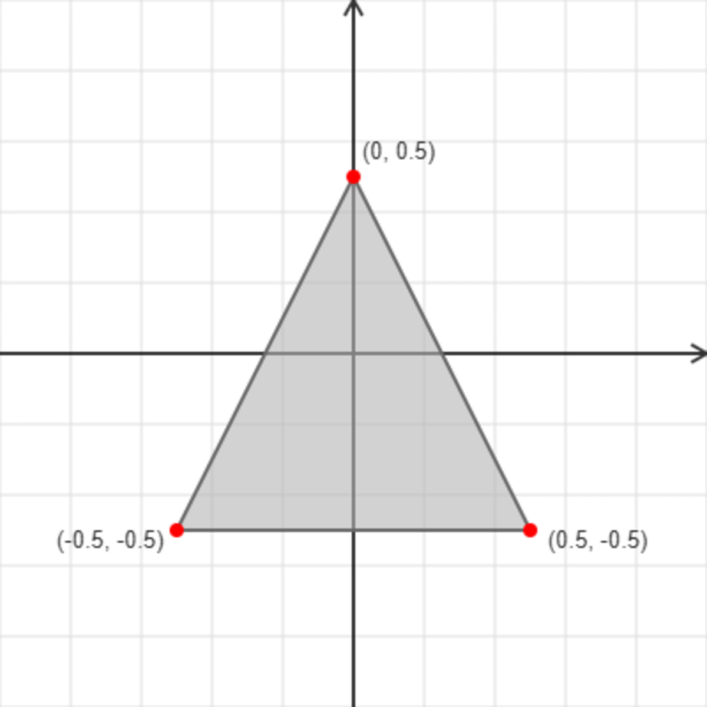

# 项目介绍

我们的测试用例普遍基于 `GLFW` 与 `GLAD`。或者 `GLM` 数学库。

使用 `GLFW` 因为 OpenGL 本身并不管理窗口，我们使用它来创建用于显示的窗口以及管理 OpenGL 上下文，也可以使用其它的一些 UI 框架，例如后续我们还会使用到 Qt，不过简单的例子先使用它。

使用 `GLAD` 是因为 OpenGL 只是一个规范/标准，具体实现是驱动开发商针对特定显卡实现的，OpenGL 的驱动版本众多，绝大多数都无法再编译期确定，所以我们就需要再运行时查询。也就是开发者需要再运行时获取函数地址然后保存在函数指针当中，以供后续使用。而 `GLAD` 恰恰是来简化这件事情的，它是目前最新最流行的库。

## DrawTriangle

[`DrawTriangle.cpp`](../examples/DrawTriangle.cpp) 例子中绘制了一个简单的平面三角形。

## 顶点数据与坐标空间

我们先不管其中的 `GLFW` 初始化、创建窗口、设置 OpenGL 上下文，`GLAD` 的加载 OpenGL 函数。关注点放在数组 `veritces`：

```cpp
std::array vertices {
    0.0f,  0.5f,  0.0f,  // 顶点1
    -0.5f, -0.5f, 0.0f,  // 顶点2
    0.5f,  -0.5f, 0.0f   // 顶点3
};
```

在代码中，我们定义了这样一个 `vertices` 数组，这是三角形的“骨架”。但在看代码前，我们需要理解 OpenGL 的一些基本概念：

- **原点位置**：不同于许多UI框架窗口左上角为原点，OpenGL 以**屏幕中心**为 $(0,0)$。
- **取值范围**：坐标范围固定在 $[-1.0, 1.0]$ 之间，这被称为**标准化设备坐标 (NDC)**。
- **顶点拆解**：
  - **顶点 1 $(0.0, 0.5)$**：X 轴居中，Y 轴向上偏移 50%。
  - **顶点 2 $(-0.5, -0.5)$**：X 轴向左偏移 50%，Y 轴向下偏移 50%。
  - **顶点 3 $(0.5, -0.5)$**：X 轴向右偏移 50%，Y 轴向下偏移 50%。

这恰好构成了一个等边三角形。

| | |
|---|---|
|  |  |
| NDC 坐标系网格 | 三角形顶点分布 |

> [!Tip]
>
> **NDC（标准化设备坐标）** 是 OpenGL 的标准坐标系统：
>
> • 坐标范围固定在 **[-1.0, 1.0]** 之间（X、Y、Z 轴都是）
>
> • 原点 (0, 0) 位于**屏幕中心**，而非左上角
>
> • 超出 [-1, 1] 范围的坐标会被裁剪掉（不显示）
>
> • 这是一个与设备无关的坐标系统，无论屏幕分辨率如何都保持一致
>

理解了这些基本概念后，我们就可以进入代码逻辑了。

